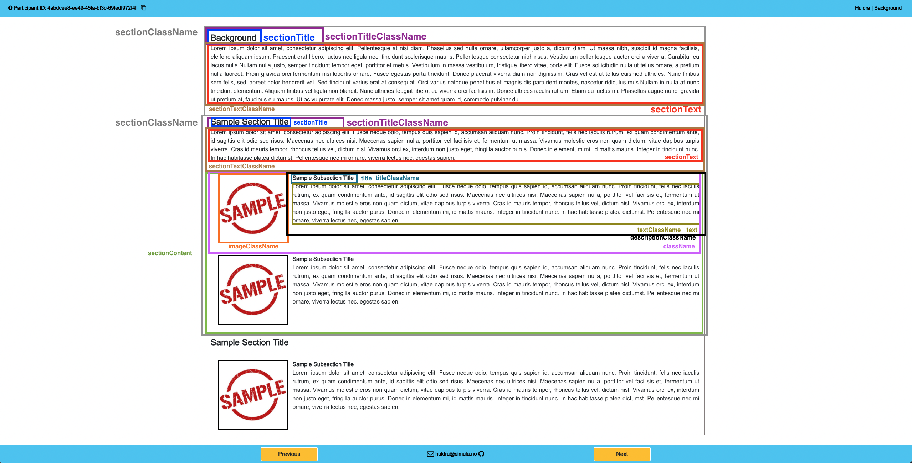
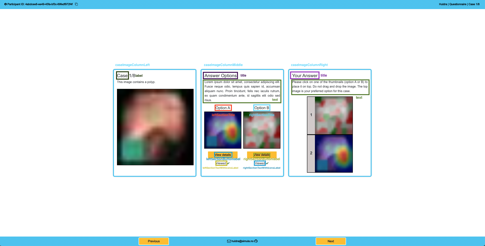
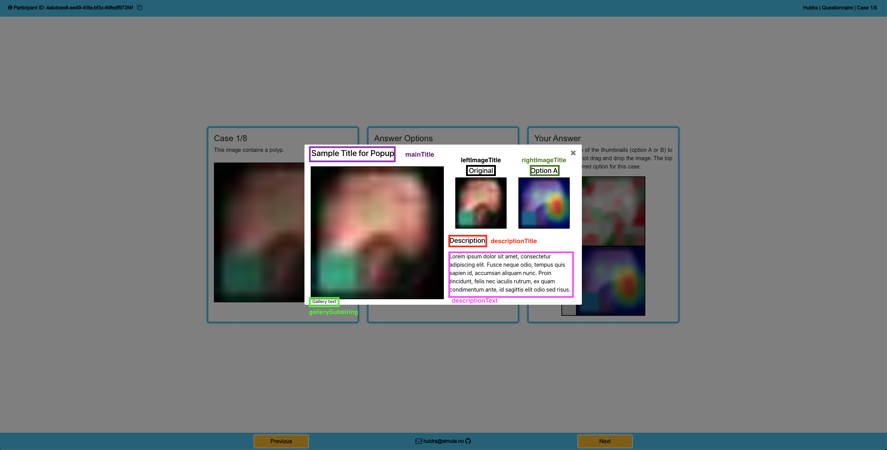
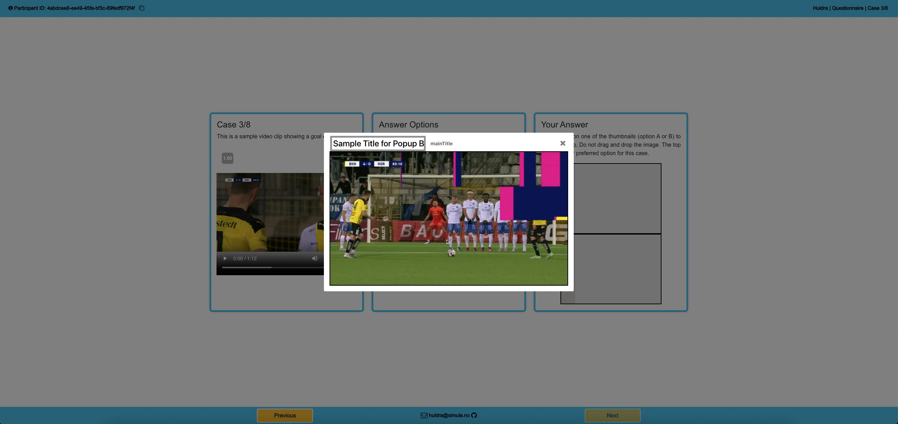
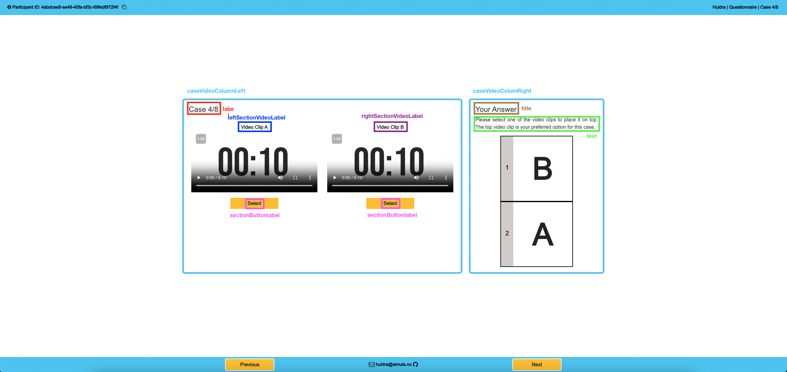
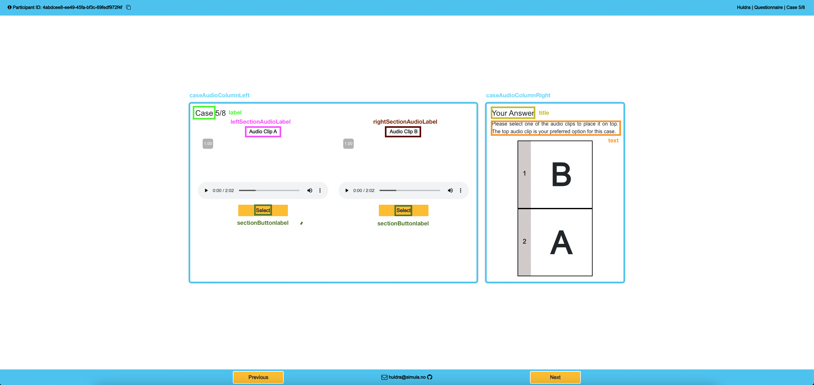
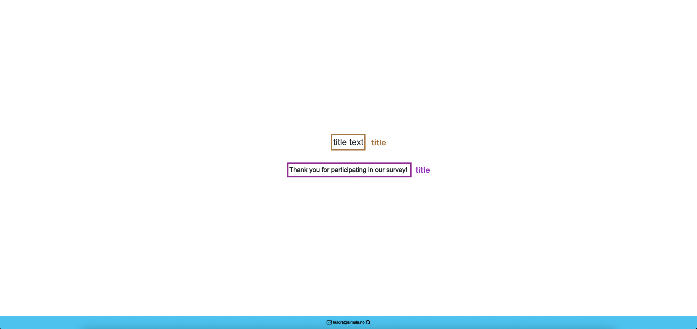

# Configuration File Documentation

The Huldra framework supports 8 type of pages[^1]:
- **Warning:** Page used to communicate to users that there is a problem.
- **Homepage:** Landing page, where the users can log in with an existing participant ID, or choose to go to the registration page to create a new participant ID.
- **Registration:** Page used to retrieve participant information/metadata.
- **Background:** Page used to display background information related to the study.
- **Demonstration:** Page that can be configured to display various multimedia content. This page can be used to check participant requirements (auditory/visual acuity, hardware/software, etc.), and/or display additional orientation information related to the study.
- **Case:** Main questionnaire page which displays survey questions. A case page can be one of 4 different types: _caseImage_, _caseHybrid_, _caseVideo_, _caseAudio_.
- **Summary and Feedback:** Page used to display the summary of the questions (and optionally responses) in the survey, and a customizable feedback form.
- **End:** Final page of the survey, which is displayed after users complete the survey and submit their responses.


[^1]: Please refer to the paper [Hammou et al.](https://dl.acm.org/doi/pdf/10.1145/3524273.3532887) for a more detailed overview of Huldra pages.

All pages are configurable using the `config.json` file. This document serves as a comprehensive guide to the parameters in the `config.json` file. 

<!---
It describes each parameter and its purpose. 
Make sure to follow the instructions and guidelines mentioned for each parameter.
The names in the table of content directly refer to the name of the configurable property. 
The properties which are next to the numbered list represent the page type that the particular parameter can configure, and the properties that are next to the bullet points represent the component of that page that it configures.
-->


## Configuration Blocks

 1. [REACT_APP_warning](#react_app_warning)
<!---
    - [Example](#example-react_app_warning)
	- [warningMessage](#warning-message)
	- [title](#title)
-->
2. [REACT_APP_home](#react_app_home)
<!---
	- [Example](#example-react_app_home)
	 - [title](#home-title)
	  - [introText](#intro-text)
	  - [signupText](#signup-text)
	  - [additionalText](#additional-text)
-->
3. [REACT_APP_registration](#react_app_registration)
<!---
	- [Example](#example-react_app_registration)
	 - [Q1](#q1)
		 - [label](#q1-label)
	 - [Q2](#q2)
		 - [label](#q2-label)
	 - [Q3](#q3)
		 - [label](#q3-label)
		 - [showTooltip](#q3-show-tooltip)
		 - [tooltipMessage](#q3-tooltip-message)
	 - [Q4](#q4)
		 - [label](#q4-label)
	 - [Q5](#q5)
		 - [label](#q5-label)
		 - [showTooltip](#q3-show-tooltip)
		 - [tooltipMessage](#q3-tooltip-message)
	 - [Q6](#q6)
		 - [label](#q6-label)
		 - [showTooltip](#q6-show-tooltip)
		 - [tooltipMessage](#q6-tooltip-message)
	 - [Q7](#q7)
		 - [label](#q7-label)
		 - [showTooltip](#q7-show-tooltip)
		 - [tooltipMessage](#q7-tooltip-message)
	 - [Q8](#q8)
		 - [label](#q8-label)
	 - [Q9](#q9)
		 - [label](#q9-label)
-->
4. [REACT_APP_background](#react_app_background)
<!---
	- [Example](#example-react_app_background)
	 - [sectionTitle](#section-title)
	 - [sectionText](#section-text)
	 - 	 [sectionClassName](#section-class-name)
	 - 	 [sectionTitleClassName](#section-title-class-name)
	 - [sectionTextClassName](#section-text-class-name)
	 - [sectionContent](#section-content)
		 - [title](#subsection-title)
		 - [sectionText](#subsection-text)
		 - [className](#subsection-class-name)
		 - [imagePath](#subsection-image-path)
		 - [imageClassName](#subsection-image-class-name)
		 - [imageAlternativeText](#subsection-image-alternative-text)
		 - [descriptionClassName](#subsection-description-class-name)
		 -  [titleClassName](#subsection-title-class-name)
		 -  [textClassName](#subsection-text-class-name)
    -  [Styling Classes](#styling-classes)
-->
5. [REACT_APP_demonstration](#react_app_demonstration)
<!---
	- [Example](#example-react_app_demonstration)
	 - [textBefore](#text-before)
	 - [textAfter](#text-after)
	 - 	[hasImage](#has-image)
	 - [imagePath](#image-path)
	 - [imageClassName](#image-class-name)
	 - [hasVideo](#has-video)
	 - [videoPath](#video-path)
	 - [videoHeight](#video-height)
	 - [videoWidth](#video-width)
	 - [hasAudio](#has-audio)
	 - [audioPath](#audio-path)
	 - [audioHeight](#audio-height)
	 - [audioWidth](#audio-width)
-->
6. [REACT_APP_caseImage](#react_app_caseimage)
<!---
	- [Example](#example-react_app_caseimage)
	 - [caseImageColumnLeft](#case-image-column-left)
		 - [label](#case-image-column-left-label)
	 - [caseImageColumnMiddle](#case-image-column-middle)
		 - [title](#case-image-column-middle-title)
		 - [text](#case-image-column-middle-text)
		 - [leftSectionTitle](#case-image-column-middle-left-section-title)
		 - [leftSectionButtonlabel](#case-image-column-middle-left-section-button-label)
		 - [leftSectionTextWithIconsLabel](#case-image-column-middle-left-section-text-with-icons-label)
		 - [rightSectionTitle](#case-image-column-middle-right-section-title)
		 - [rightSectionButtonlabel](#case-image-column-middle-right-section-button-label)
		 - [rightSectionTextWithIconsLabel](#case-image-column-middle-right-section-text-with-icons-label)
		 - [popupA](#case-image-column-middle-popupa)
		 - [popupB](#case-image-column-middle-popupb)
			 - [mainTitle](#case-image-column-middle-popup-main-title)
			 - [leftImageTitle](#case-image-column-middle-popup-left-image-title)
			 - [rightImageTitle](#case-image-column-middle-popup-right-image-title)
			 - [descriptionTitle](#case-image-column-middle-popup-description-title)
			 - [descriptionText](#case-image-column-middle-popup-description-text)
			 - [gallerySubstring](#case-image-column-middle-popupb-gallery-substring)
    - [caseImageColumnRight](#case-image-column-right)
        - [title](#case-image-column-right-title)
        - [text](#case-image-column-right-text)
-->
7. [REACT_APP_caseHybrid](#react_app_casehybrid)
<!---
    - [Example](#example-react_app_casehybrid)
    - [caseHybridColumnLeft](#case-hybrid-column-left)
        - [label](#case-hybrid-column-left-label)
    - [caseHybridColumnMiddle](#case-hybrid-column-middle)
        - [title](#case-hybrid-column-middle-title)
        - [text](#case-hybrid-column-middle-text)
        - [leftSectionTitle](#case-hybrid-column-middle-left-section-title)
        - [leftSectionButtonlabel](#case-hybrid-column-middle-left-section-button-label)
        - [leftSectionTextWithIconsLabel](#case-hybrid-column-middle-left-section-text-with-icons-label)
        - [rightSectionTitle](#case-hybrid-column-middle-right-section-title)
        - [rightSectionButtonlabel](#case-hybrid-column-middle-right-section-button-label)
        - [rightSectionTextWithIconsLabel](#case-hybrid-column-middle-right-section-text-with-icons-label)
        - [popupA](#case-hybrid-column-middle-popupa)
        - [popupB](#case-hybrid-column-middle-popupb)
            - [mainTitle](#case-hybrid-column-middle-popup-main-title)
    - [caseHybridColumnRight](#case-hybrid-column-right)
        - [title](#case-hybrid-column-right-title)
        - [text](#case-hybrid-column-right-text)
-->
8. [REACT_APP_caseVideo](#react_app_casevideo)
<!---
    - [Example](#example-react_app_casevideo)
    - [caseVideoColumnLeft](#case-video-column-left)
        - [label](#case-video-column-left-label)
        - [sectionVideoHeight](#case-video-column-left-section-video-height)
        - [sectionVideoWidth](#case-video-column-left-section-video-width)
        - [rightSectionVideoLabel](#case-video-column-left-rightsectionvideolabel)
        - [leftSectionVideoLabel](#case-video-column-left-leftsectionvideolabel)
        - [sectionButtonlabel](#case-video-column-left-section-button-label)
    - [caseVideoColumnRight](#case-video-column-right)
        - [title](#case-video-column-right-title)
        - [text](#case-video-column-right-text) 
-->
9. [REACT_APP_caseAudio](#react_app_caseaudio)
<!---
    - [Example](#example-react_app_caseaudio)
    - [caseAudioColumnLeft](#case-audio-column-left)
        - [label](#case-audio-column-left-label)
        - [sectionAudioHeight](#case-audio-column-left-section-audio-height)
        - [sectionAudioWidth](#case-audio-column-left-section-audio-width)
        - [rightSectionAudioLabel](#case-audio-column-left-rightsectionaudiolabel)
        - [leftSectionAudioLabel](#case-audio-column-left-leftsectionaudiolabel)
        - [sectionButtonlabel](#case-audio-column-left-section-button-label)
    - [caseAudioColumnRight](#case-audio-column-right)
        - [title](#case-audio-column-right-title)
        - [text](#case-audio-column-right-text)
-->
10. [REACT_APP_summaryAndFeedback](#react_app_summaryandfeedback)
<!---
    - [Example](#example-react_app_summaryandfeedback)
    - [summary](#summary)
        - [display](#summary-display)
        - [highlightAnswers](#summary-highlightanswers)
        - [title](#summary-title)
        - [text](#summary-text)
        - [label](#summary-label)
        - [videoPlaceholderIconPath](#summary-videoplaceholdericonPath)
        - [audioPlaceholderIconPath](#summary-audioplaceholdericonPath)
        - [imagePlaceholderIconPath](#summary-imageplaceholdericonPath)
    - [feedbackForm](#feedbackform)
        - [title](#feedbackform-title)
        - [text](#feedbacform-text)
        - [label](#feedbackform-label)
        - [feedbackFormQuestions](#feedbackform-feedbackformquestions)
            - [questionType](#feedbackformquestions-questiontype)
            - [id](#feedbackformquestions-id)
            - [label](#feedbackformquestions-label)
            - [likertQuestions](#feedbackformquestions-likertquestions)
                - [question](#feedbackformquestions-likertquestions-question)
                - [size](#feedbackformquestions-likertquestions-size)
                - [label](#feedbackformquestions-likertquestions-label)
            - [choices](#feedbackformquestions-choices)
            - [hasCommentBox](#feedbackformquestions-hascommentbox)
            - [commentBoxLabel](#feedbackformquestions-commentboxlabel)
-->
11. [REACT_APP_end](#react_app_end)
<!---
    - [Example](#example-react_app_end)
	- [title](#react_app_end-title)
	- [endMessage](#react_app_end-endmessage)
	- [redirectTimeout](#react_app_end-redirecttimeout)
-->
12. [REACT_APP_footer](#react_app_footer)
<!---
    - [Example](#example-react_app_footer)
	- [icon1ClassName](#react_app_footer-icon1classname)
	- [icon2ClassName](#react_app_footer-icon2classname)
	- [icon1Url](#react_app_footer-icon1url)
	- [icon2Url](#react_app_footer-icon2url)
	- [label](#react_app_footer-label)
-->
13. [REACT_APP_header](#react_app_header)
<!---
    - [Example](#example-react_app_header)
	- [labelBackground](#react_app_header-labelbackground)
	- [labelDemonstration](#react_app_header-labeldemonstration)
	- [labelCase](#react_app_header-labelcase)
	- [labelSummaryAndFeedback](#react_app_header-labelsummaryandfeedback)
 -->
14. [REACT_APP_general](#react_app_general)


## REACT_APP_warning

The warning page is used to display a warning when the user's screen resolution is less than 1200 x 800, or if there is any other rendering problem. 
The warning page is configured using the `REACT_APP_warning` block in the `config.json` file. 

### Parameters

The `REACT_APP_warning` block contains 2 elements.
- `warningMessage`: The actual message displayed to the user when there is a rendering error is defined by this element. 
- `title`: The heading of actual message displayed to the user when there is a rendering error is defined by this element.

### Visual Overview


### Sample Config  

```json
"REACT_APP_warning": {
"warningMessage": "Please view this page on a device with a screen resolution of at least 1200 x 800.",
"title": "Huldra"
}
```


## REACT_APP_home

The homepage serves as the landing page. 
The homepage is configured using the `REACT_APP_homepage` block in the `config.json` file. 

### Parameters

The `REACT_APP_homepage` block contains 4 elements.
- `title`: This element is used to show the title on the home page. 
- `introText`: This element is used to configure the introduction text shown at the home page.
- `signupText`: This element is used to configure the subheading, signup text shown at the home page.
- `additionalText`: This element configures the additional text shown on the home page.

### Visual Overview


### Sample Config 

```json
"REACT_APP_home": {
"title": "Huldra: Sample Title",
"introText": "This is a sample subtitle or introduction text.",
"signupText": "If you don't have a participant ID, you can have one by clicking the button below.",
"additionalText": "Please view this application in full-screen mode."
}
```


## REACT_APP_registration

The registration page is used to retrieve participant information/metadata. 
The registration page is configured using the `REACT_APP_registration` block in the `config.json` file. 

 
<!---
### Example REACT_APP_registration

```json
"REACT_APP_registration": {

"Q1": {

"label": "Name"

},

"Q2": {

"label": "E-mail address"

},

"Q3": {

"label": "Country",

"showTooltip": true,

"tooltipMessage": "This field is mandatory."

},

"Q4": {

"label": "Comments"

},

"Q5": {

"label": "Degree",

"showTooltip": true,

"tooltipMessage": "This field is mandatory."

},

"Q6": {

"label": "Mandatory question",

"showTooltip": true,

"tooltipMessage": "This field is mandatory."

},

"Q7": {

"label": "Optional question",

"showTooltip": true,

"tooltipMessage": "This field is mandatory and must be a number."

},

"Q8": {

"label": "Text for mandatory tickbox."

},

"Q9": {

"label": "Text for optional tickbox."

}

}
```

-  **Exact Name**: `REACT_APP_registration`

-  **Description**:  The components of these element are used to configure the regestration page. Nine diffrerent questions can be configured. If you are creating a REACT_APP_registration element, make sure to include all the 9 questions inside. 

### Q1

-  **Exact Name**: `Q1`
-  **Description**:  Element used to display the 1st question on the registration page

### Q1 Label

-  **Exact Name**: `label`
-  **Description**: Element to describe the label/heading of the 1st question. 

### Q2

-  **Exact Name**: `Q2`
-  **Description**:  Element used to display the 2nd question on the registration page

### Q2 Label

-  **Exact Name**: `label`
-  **Description**: Element to describe the label/heading of the 2nd question. 

### Q3

-  **Exact Name**: `Q3`
-  **Description**:  Element used to display the 3rd question on the registration page

### Q3 Label

-  **Exact Name**: `label`
-  **Description**: Element to describe the label/heading of the 3rd question. 

### Q3 Show Tooltip

-  **Exact Name**: `showTooltip`
-  **Description**: A bool to set whether to show the tooltip for the question or not. 

### Q3 Tooltip Message

-  **Exact Name**: `tooltipMessage`
-  **Description**: Element to describe the label/heading of the tooltip.


### Q4

-  **Exact Name**: `Q4`
-  **Description**:  Element used to display the 4th question on the registration page

### Q4 Label

-  **Exact Name**: `label`
-  **Description**: Element to describe the label/heading of the 4th question. 

### Q5

-  **Exact Name**: `Q5`
-  **Description**:  Element used to display the 5th question on the registration page

### Q5 Label

-  **Exact Name**: `label`
-  **Description**: Element to describe the label/heading of the 5th question. 

### Q5 Show Tooltip

-  **Exact Name**: `showTooltip`
-  **Description**: A bool to set whether to show the tooltip for the question or not. 

### Q5 Tooltip Message

-  **Exact Name**: `tooltipMessage`
-  **Description**: Element to describe the label/heading of the tooltip.

### Q6

-  **Exact Name**: `Q6`
-  **Description**:  Element used to display the 6th question on the registration page

### Q6 Label

-  **Exact Name**: `label`
-  **Description**: Element to describe the label/heading of the 6th question. 

### Q6 Show Tooltip

-  **Exact Name**: `showTooltip`
-  **Description**: A bool to set whether to show the tooltip for the question or not. 

### Q6 Tooltip Message

-  **Exact Name**: `tooltipMessage`
-  **Description**: Element to describe the label/heading of the tooltip.

### Q7

-  **Exact Name**: `Q7`
-  **Description**:  Element used to display the 7th question on the registration page

### Q7 Label

-  **Exact Name**: `label`
-  **Description**: Element to describe the label/heading of the 7th question. 

### Q7 Show Tooltip

-  **Exact Name**: `showTooltip`
-  **Description**: A bool to set whether to show the tooltip for the question or not. 

### Q7 Tooltip Message

-  **Exact Name**: `tooltipMessage`
-  **Description**: Element to describe the label/heading of the tooltip.

### Q8

-  **Exact Name**: `Q8`
-  **Description**:  Element used to display the 8th question on the registration page

### Q8 Label

-  **Exact Name**: `label`
-  **Description**: Element to describe the label/heading of the 8th question. 

### Q9

-  **Exact Name**: `Q9`
-  **Description**:  Element used to display the 9th question on the registration page

### Q9 Label

-  **Exact Name**: `label`
-  **Description**: Element to describe the label/heading of the 9th question. 
-->


## REACT_APP_background

The background page is used to display background information related to the study. 
The background page is configured using the `REACT_APP_background` block in the `config.json` file. 

### Parameters

The background page can contain as many sections as desired, where each section contains as many subsections as desired. 

The `REACT_APP_warning` block contains the following elements for each section.
- `sectionTitle`: Title of the section is defined with this property.
- `sectionText`: Text of the section is defined with this property.
- `sectionClassName`: Styling of section is defined by choosing the predefined classes. Check the styling classes section for more details regarding particular classes.
- `sectionTitleClassName`: Styling of title of the section is defined by choosing the predefined classes. Check the styling classes section for more details regarding particular classes.
- `sectionTextClassName`: Styling of text of the section is defined by choosing the predefined classes. Check the styling classes section for more details regarding particular classes.
- `sectionContent`: This element is used to define the subsections under sections. Create multipule objects under the array to create multipule subsections, i.e., every subsection is one object.

The `REACT_APP_warning` block contains the following elements for each subsection (i.e., for each object under `sectionContent`).
- `title`: Title of the subsection is defined by this property.
- `sectionText`: Text of the subsection is defined by this property.
- `className`: Styling of subsection is defined by choosing the predefined classes. Check the styling classes section for more details regarding particular classes.
- `imagePath`: Define the path of the image located on firebase to here to display the image on subsection.
- `imageClassName`: Styling of image on the subsection is defined by choosing the predefined classes. Check the styling classes section for more details regarding particular classes.
- `imageAlternativeText`: Alternative text to be displayed, if the image is not available is defined here.
- `descriptionClassName`: Styling of description on the subsection is defined by choosing the predefined classes. Check the styling classes section for more details regarding particular classes.
- `titleClassName`: Styling of title of the subsection is defined by choosing the predefined classes. Check the styling classes section for more details regarding particular classes.
- `textClassName`: Styling of text of the subsection is defined by choosing the predefined classes. Check the styling classes section for more details regarding particular classes.
  
### Visual Overview



### Sample Config

```json
"REACT_APP_background": [
    {
      "sectionTitle": "Background",
      "sectionText": "Lorem ipsum dolor ",
      "sectionClassName": "background-section",
      "sectionTitleClassName": "background-section-title",
      "sectionTextClassName": "background-text-content",
      "sectionContent": [
        {
          "title": "Sample Subsection Title",
          "text": "Lorem ipsum dolor ",
          "className": "background-single-block",
          "imagePath": "/gallery/sample-image.png",
          "imageClassName": "explanation-background-image",
          "imageAlternativeText": "sample-image",
          "descriptionClassName": "background-single-block-description-content",
          "titleClassName": "background-single-block-description-label",
          "textClassName": "background-text-content"
        }
      ]
    }
  ]
```


<!--


-  **Exact Name**: `REACT_APP_background`
-  **Description**: This element is used to define the information on background page. This is defined as an array, since multipule sections for information can be defined here. Every section is one object.

### Styling Classes

```json
".background {
    height: 100%;
    overflow-y: auto;
    text-align: left;
    padding: 0 0.8em 0.8em 0.8em;
}

.background-section-title {
    font-weight: 700;
    font-size: 1.5em;
}

.background-section {
    margin-top: 2em;
}

.background-single-block {
    margin-left: 1.3em;
    margin-top: 2em;
    align-items: flex-start;
    display: flex;
}

.background-single-block-description-content {
    padding-left: 0.8em;
    height: 100%;
}

.background-single-block-description-label {
    font-weight: 700;
    font-size: 1em;
}

.background::-webkit-scrollbar-track {
    -webkit-box-shadow: inset 0 0 6px rgba(0, 0, 0, 0.3);
    border-radius: 0.4em;
    background-color: #f5f5f5;
}

.background::-webkit-scrollbar {
    width: 0.3em;
    background-color: #f5f5f5;
}

.background::-webkit-scrollbar-thumb {
    border-radius: 10px;
    -webkit-box-shadow: inset 0 0 6px rgba(0, 0, 0, 0.3);
    background-color: #9c9393;
}

.background-text-content {
    text-align: justify;
}"
```
-->


## REACT_APP_demonstration

The demonstration page(s) can be configured to display various multimedia content. 
The demonstration page(s) are configured using the `REACT_APP_demonstration` block in the `config.json` file.

### Parameters

Huldra can include up to 3 demonstration pages, where each page can contain an image, video, or audio. 

The `REACT_APP_demonstration` block contains the following elements for each demonstration page.
- `textBefore`: Text written on line 1 can be configured here.
- `textAfter`: Text written on line 2 can be configured here.
- `hasImage`: A bool. Set it true to display an image on the demonstration page.
- `imagePath`: Define the path of the image located on firebase to here to display the image on the demonstration page. **Note:** `hasImage` bool has to be set true in order to put the image on the demonstartion page.
- `imageClassName`: The class used to define styling of the image on demonstration page. As of now there is only one class available to define the image styling. The class name is "demonstration-image", whose height is defined as 22em and width is auto adjusted.
- `hasVideo`: A bool. Set it true to display a video on the demonstration page.
- `videoPath`: Define the path of the video on firebase to here to display the video on the demonstartion page. **Note:** `hasVideo` bool has to be set true in order to put the video on the demonstartion page.
- `videoHeight`: Define the height of the video player in px.
- `videoWidth`: Define the width of the video player in px.
- `hasAudio`: A bool. Set it true to put an audio on the demonstration page.
- `audioPath`: Define the path of the audio on firebase to here to put the audio on the demonstartion page. **Note:** `hasAudio` bool has to be set true in order to put the audio on the demonstartion page.
- `audioHeight`: Define the height of the audio player in px.
- `audioWidth`: Define the width of the audio player in px.


### Visual Overview


### Sample Config

```json
  "REACT_APP_demonstration": [
    {
      "textBefore": "You can have a demonstration page with a single image.",
      "textAfter": "You can use this page to describe how the rest of the survey works.",
      "hasImage": true,
      "imagePath": "/gallery/sample-image.png",
      "imageClassName": "demonstration-image"
    },
    {
      "textBefore": "You can have a demonstration page with a single video player (custom size).",
      "textAfter": "You can use this page to run a video check, or to display a tutorial video showing how the rest of the survey works.",
      "hasVideo": true,
      "videoPath": "/gallery/countdown.mp4",
      "videoHeight": "300px",
      "videoWidth": "450px"
    },
    {
      "textBefore": "You can have a demonstration page with a single audio player (custom size).",
      "textAfter": "You can use this page to run a sound check, or to play a tutorial audio describing how the rest of the survey works.",
      "hasAudio": true,
      "audioPath": "/gallery/audio-sample.mp3",
      "audioHeight": "300px",
      "audioWidth": "450px"
    }
  ]
```

<!---
-  **Exact Name**: `REACT_APP_demonstration`
-  **Description**: This element is used to configure the demonstartion page. You can demonstrate image, video, and audio to the user. It is mandatody to have this array. The number of objects in this array define the number of demonstartion pages. To have no demonstartion page at all, make this as an empty array. The demonstration page is comprised of the elements below:
-->


## REACT_APP_caseImage

<!---
-  **Exact Name**: `REACT_APP_caseImage`
-  **Description**: This element is used to configure the Image Case page, where a user can rank 2 images.





### Example REACT_APP_caseImage
```json
  "REACT_APP_caseImage": {
    "caseImageColumnLeft": { "label": "Case" },
    "caseImageColumnMiddle": {
      "title": "Answer Options",
      "text": "Lorem ipsum dolor sit amet, consectetur adipiscing elit.",
      "leftSectionTitle": "Option A",
      "leftSectionButtonlabel": "View details",
      "leftSectionTextWithIconsLabel": "Viewed",
      "rightSectionTitle": "Option B",
      "rightSectionButtonlabel": "View details",
      "rightSectionTextWithIconsLabel": "Viewed",
      "popupA": {
        "mainTitle": "Sample Title for Popup A",
        "leftImageTitle": "Original",
        "rightImageTitle": "Option A",
        "descriptionTitle": "Description",
        "descriptionText": "Lorem ipsum dolor sit amet, ."
      },
      "popupB": {
        "mainTitle": "Sample Title for Popup B",
        "leftImageTitle": "Original",
        "rightImageTitle": "Option B",
        "descriptionTitle": "Description",
        "descriptionText": "Lorem ipsum dolor sit amet,.",
        "gallerySubstring": "similar"
      }
    },
    "caseImageColumnRight": {
      "title": "Your Answer",
      "text": "Please click on one of the thumbnails (option A or B) to place it on top. Do not drag and drop the image. The top image is your preferred option for this case."
    }
  }
```

  

### Case Image Column Left  

-  **Exact Name**: `caseImageColumnLeft`
-  **Description**: This element is used to configure the left column of case image page. The left column can be configured acording to the parameter(s) below:

### Case Image Column Left Label

  

-  **Exact Name**: `label`
-  **Description**: This element is used to configure the heading on the left column of case image page.


### Case Image Column Middle

  

-  **Exact Name**: `caseImageColumnMiddle`  
-  **Description**: This element is used to configure the middle column of case image page. The middle column can be configured acording to the parameter(s) below:

### Case Image Column Middle Title

-  **Exact Name**: `title`
-  **Description**: This element is used to configure the heading on the middle column of case image page.


### Case Image Column Middle Text

  

-  **Exact Name**: `text`
-  **Description**: This element is used to configure the descriptive text on the middle column of case image page.


### Case Image Column Middle Left Section Title

  

-  **Exact Name**: `leftSectionTitle`
-  **Description**: This element is used to configure the heading text over the left image on the middle column of case image page.

### Case Image Column Middle Left Section Button Label

  

-  **Exact Name**: `leftSectionButtonlabel`  
-  **Description**: This element is used to configure the text of the button located below the left image on the middle column of case image page.

### Case Image Column Middle Left Section Text With Icons Label

  

-  **Exact Name**: `leftSectionTextWithIconsLabel`
-  **Description**: This element is used to configure the text below the button located below the left image on the middle column of case image page. This text is only visible when the user has clicked on the mentioned button.

### Case Image Column Middle Right Section Title

  

-  **Exact Name**: `rightSectionTitle`
-  **Description**: This element is used to configure the heading text over the right image on the middle column of case image page.

### Case Image Column Middle Right Section Button Label

  

-  **Exact Name**: `rightSectionButtonlabel`  
-  **Description**: This element is used to configure the text of the button located below the right image on the middle column of case image page.

### Case Image Column Middle Right Section Text With Icons Label

  

-  **Exact Name**: `rightSectionTextWithIconsLabel`
-  **Description**: This element is used to configure the text below the button located below the right image on the middle column of case image page. This text is only visible when the user has clicked on the mentioned button.


### Case Image Column Middle PopupA

  

-  **Exact Name**: `popupA`
-  **Description**: This element is used to configure the popup which opens after clicking on the button located below the left image on the middle column of case image page.

### Case Image Column Middle PopupB

  

-  **Exact Name**: `popupB`
-  **Description**: This element is used to configure the popup which opens after clicking on the button located below the right image on the middle column of case image page.


### Case Image Column Middle Popup Main Title

  

-  **Exact Name**: `mainTitle`
-  **Description**: 
When the  button below the any of the smaller image on the middle column of the case image page is clicked a popup appears. This element configures up the main heading on the popup, which is positioned above the first image on the popup (the large one).


### Case Image Column Middle Popup Left Image Title

  

-  **Exact Name**: `leftImageTitle`
-  **Description**: When the button below the any of the smaller image on the middle column of the case image page is clicked a popup appears. This element configures up the heading for the second image, which is the left one among the two small images, on the popup.

### Case Image Column Middle Popup Right Image Title

  

-  **Exact Name**: `leftImageTitle`
-  **Description**: When the button below the any of the smaller image on the middle column of the case image page is clicked a popup appears. This element configures up the heading for the third image, which is the right one among the two small images, on the popup.

### Case Image Column Middle Popup Description Title

  

-  **Exact Name**: `descriptionTitle`
-  **Description**:
When the button below the any of the smaller image on the middle column of the case image page is clicked a popup appears. This element configures up the description heading of the popup. The description heading is positioned below the 2 smaller images.


### Case Image Column Middle Popup Description Text

  

-  **Exact Name**: `descriptionText`
-  **Description**: When the button below the any of the smaller image on the middle column of the case image page is clicked a popup appears. This element configures up the description text of the popup.

### Case Image Column Middle PopupB Gallery Substring

  

-  **Exact Name**: `descriptionText`
-  **Description**: When the button below the any of the smaller image on the middle column of the case image page is clicked a popup appears. This element configures the string below the larger image(1st one). NOTE: This is exclusive to popup B (the one which opens after clicking on the button located below the right image on the middle column of case image page.)

### Case Image Column Right

  

-  **Exact Name**: `caseImageColumnRight`
-  **Description**: This element is used to configure the right column of case image page. The right column can be configured acording to the parameter(s) below:

### Case Image Column Right Title

  

-  **Exact Name**: `title`
-  **Description**: This element is used to configure the heading on the right column of case image page.


### Case Image Column Right text

  

-  **Exact Name**: `text`
-  **Description**: This element is used to configure the text description on the right column of case image page.
-->


## REACT_APP_caseHybrid
<!--




-  **Exact Name**: `REACT_APP_caseHybrid`
-  **Description**: This element is used to configure the Hybrid Case page, where a user can view a video, compare two image options, and provide their answer in the right column.

### Example REACT_APP_caseHybrid


```json
    "REACT_APP_caseHybrid": {
    "caseHybridColumnLeft": { "label": "Case" },
    "caseHybridColumnMiddle": {
      "title": "Answer Options",
      "text": "Lorem ipsum dolor sit amet, consectetur adipiscing elit. Fusce neque odio, tempus quis sapien id, accumsan aliquam nunc. Proin tincidunt, felis nec iaculis rutrum, ex quam condimentum ante, id sagittis elit odio sed risus.",
      "leftSectionTitle": "Option A",
      "leftSectionButtonlabel": "View details",
      "leftSectionTextWithIconsLabel": "Viewed",
      "rightSectionTitle": "Option B",
      "rightSectionButtonlabel": "View details",
      "rightSectionTextWithIconsLabel": "Viewed",
      "popupA": {
        "mainTitle": "Sample Title for Popup A",
        "leftImageTitle": "Original",
        "rightImageTitle": "Option A",
        "descriptionTitle": "Description",
        "descriptionText": "Lorem ipsum dolor sit amet, consectetur adipiscing elit. Fusce neque odio, tempus quis sapien id, accumsan aliquam nunc. Proin tincidunt, felis nec iaculis rutrum, ex quam condimentum ante, id sagittis elit odio sed risus."
      },
      "popupB": {
        "mainTitle": "Sample Title for Popup B",
        "leftImageTitle": "Original",
        "rightImageTitle": "Option B",
        "descriptionTitle": "Description",
        "descriptionText": "Lorem ipsum dolor sit amet, consectetur adipiscing elit. Fusce neque odio, tempus quis sapien id, accumsan aliquam nunc. Proin tincidunt, felis nec iaculis rutrum, ex quam condimentum ante, id sagittis elit odio sed risus.",
        "gallerySubstring": "similar"
      }
    },
    "caseHybridColumnRight": {
      "title": "Your Answer",
      "text": "Please click on one of the thumbnails (option A or B) to place it on top. Do not drag and drop the image. The top image is your preferred option for this case."
    }
  },
```

  

### Case Hybrid Column Left  

-  **Exact Name**: `caseHybridColumnLeft`
-  **Description**: This element is used to configure the left column of case hybrid page. The left column can be configured acording to the parameter(s) below:

### Case Hybrid Column Left Label

-  **Exact Name**: `label`
-  **Description**: This element is used to configure the heading on the left column of case hybrid page.


### Case Hybrid Column Middle

 
-  **Exact Name**: `caseHybridColumnMiddle`  
-  **Description**: This element is used to configure the middle column of case hybrid page. The middle column can be configured acording to the parameter(s) below:

### Case Hybrid Column Middle Title

-  **Exact Name**: `title`
-  **Description**: This element is used to configure the heading on the middle column of case hybrid page.


### Case Hybrid Column Middle Text

  

-  **Exact Name**: `text`
-  **Description**: This element is used to configure the descriptive text on the middle column of case hybrid page.


### Case Hybrid Column Middle Left Section Title

  

-  **Exact Name**: `leftSectionTitle`
-  **Description**: This element is used to configure the heading text over the left image on the middle column of case hybrid page.

### Case Hybrid Column Middle Left Section Button Label

  

-  **Exact Name**: `leftSectionButtonlabel`  
-  **Description**: This element is used to configure the text of the button located below the left image on the middle column of case hybrid page.

### Case Hybrid Column Middle Left Section Text With Icons Label

  

-  **Exact Name**: `leftSectionTextWithIconsLabel`
-  **Description**: This element is used to configure the text below the button located below the left image on the middle column of case hybrid page. This text is only visible when the user has clicked on the mentioned button.

### Case Hybrid Column Middle Right Section Title


-  **Exact Name**: `rightSectionTitle`
-  **Description**: This element is used to configure the heading text over the right image on the middle column of case hybrid page.

### Case Hybrid Column Middle Right Section Button Label

  

-  **Exact Name**: `rightSectionButtonlabel`  
-  **Description**: This element is used to configure the text of the button located below the right image on the middle column of case hybrid page.

### Case Hybrid Column Middle Right Section Text With Icons Label

  

-  **Exact Name**: `rightSectionTextWithIconsLabel`
-  **Description**: This element is used to configure the text below the button located below the right image on the middle column of case hybrid page. This text is only visible when the user has clicked on the mentioned button.


### Case Hybrid Column Middle PopupA

  

-  **Exact Name**: `popupA`
-  **Description**: This element is used to configure the popup which opens after clicking on the button located below the left image on the middle column of case H\hybrid page.

### Case Hybrid Column Middle PopupB

  

-  **Exact Name**: `popupB`
-  **Description**: This element is used to configure the popup which opens after clicking on the button located below the right image on the middle column of case hybrid page.


### Case Hybrid Column Middle Popup Main Title

  

-  **Exact Name**: `mainTitle`
-  **Description**: 
When the  button below the any of the smaller image on the middle column of the case hybrid page is clicked a popup appears. This element configures up the main heading on the popup, which is positioned above the first image on the popup (the large one).


### Case Hybrid Column Right

  

-  **Exact Name**: `caseHybridColumnRight`
-  **Description**: This element is used to configure the right column of case image page. The right column can be configured acording to the parameter(s) below:

### Case Hybrid Column Right Title

  

-  **Exact Name**: `title`
-  **Description**: This element is used to configure the heading on the right column of case hybrid page.


### Case Hybrid Column Right Text

  

-  **Exact Name**: `text`
-  **Description**: This element is used to configure the text description on the right column of case image page.
-->

## REACT_APP_caseVideo
<!--



-  **Exact Name**: `REACT_APP_caseVideo`
-  **Description**: This element is used to configure the Video Case page, where a user can rank 2 videos. 

### Example REACT_APP_caseVideo
```json
  "REACT_APP_caseVideo": {
    "caseVideoColumnLeft": {
      "label": "Case",
      "sectionVideoHeight": "200px",
      "sectionVideoWidth": "410px",
      "rightSectionVideoLabel": "Video Clip B",
      "leftSectionVideoLabel": "Video Clip A",
      "sectionButtonlabel": "Select"
    },
    "caseVideoColumnRight": {
      "title": "Your Answer",
      "text": "Please select one of the video clips to place it on top. The top video clip is your preferred option for this case."
    }
  },
```

  

### Case Video Column Left  

-  **Exact Name**: `caseVideoColumnLeft`
-  **Description**: This element is used to configure the left column of case video page. The left column can be configured acording to the parameter(s) below:

### Case Video Column Left Label

-  **Exact Name**: `label`
-  **Description**: This element is used to configure the heading on the left column of case Video page.
- 
### Case Video Column Left Section Video Height

-  **Exact Name**: `sectionVideoHeight`
-  **Description**: This element is used to configure the height of the video players on the left column of case video page.


### Case Video Column Left Section Video Width

-  **Exact Name**: `sectionVideoWidth`
-  **Description**: This element is used to configure the width of the video players on the left column of case video page.

### Case Video Column Left rightSectionVideoLabel

-  **Exact Name**: `rightSectionVideoLabel`
-  **Description**: This element is used to configure the heading of the right video on the left column of case video page.


### Case Video Column Left leftSectionVideoLabel

-  **Exact Name**: `leftSectionVideoLabel`
-  **Description**: This element is used to configure the heading of the left video on the left column of case video page.


### Case Video Column Left Section Button Label

-  **Exact Name**: `sectionButtonlabel`
-  **Description**: This element is used to configure the label of the buttons below the videos  on the left column of case video page.


### Case Video Column Right

-  **Exact Name**: `caseVideoColumnRight`
-  **Description**: This element is used to configure the right column of case video page. The right column can be configured acording to the parameter(s) below:

### Case Video Column Right Title

-  **Exact Name**: `title`
-  **Description**: This element is used to configure the heading on the right column of case video page.


### Case Video Column Right Text
  

-  **Exact Name**: `text`
-  **Description**: This element is used to configure the text description on the right column of case video page.
-->

## REACT_APP_caseAudio
<!---



-  **Exact Name**: `REACT_APP_caseAudio`
-  **Description**: This element is used to configure the Audio Case page, where a user can rank 2 audios. 

### Example REACT_APP_caseAudio
```json
  "REACT_APP_caseAudio": {
    "caseAudioColumnLeft": {
      "label": "Case",
      "sectionAudioHeight": "200px",
      "sectionAudioWidth": "410px",
      "rightSectionAudioLabel": "Audio Clip B",
      "leftSectionAudioLabel": "Audio Clip A",
      "sectionButtonlabel": "Select"
    },
    "caseAudioColumnRight": {
      "title": "Your Answer",
      "text": "Please select one of the audio clips to place it on top. The top audio clip is your preferred option for this case."
    }
  },
```

  

### Case Audio Column Left  

-  **Exact Name**: `caseAudioColumnLeft`
-  **Description**: This element is used to configure the left column of case audio page. The left column can be configured acording to the parameter(s) below:

### Case Audio Column Left Label

-  **Exact Name**: `label`
-  **Description**: This element is used to configure the heading on the left column of case Audio page.
- 
### Case Audio Column Left Section Audio Height

-  **Exact Name**: `sectionAudioHeight`
-  **Description**: This element is used to configure the height of the audio players on the left column of case audio page.


### Case Audio Column Left Section Audio Width

-  **Exact Name**: `sectionAudioWidth`
-  **Description**: This element is used to configure the width of the audio players on the left column of case audio page.

### Case Audio Column Left rightSectionAudioLabel

-  **Exact Name**: `rightSectionAudioLabel`
-  **Description**: This element is used to configure the heading of the right audio on the left column of case audio page.


### Case Audio Column Left leftSectionAudioLabel

-  **Exact Name**: `leftSectionAudioLabel`
-  **Description**: This element is used to configure the heading of the left audio on the left column of case audio page.


### Case Audio Column Left Section Button Label

-  **Exact Name**: `sectionButtonlabel`
-  **Description**: This element is used to configure the label of the buttons below the audios  on the left column of case audio page.


### Case Audio Column Right

-  **Exact Name**: `caseAudioColumnRight`
-  **Description**: This element is used to configure the right column of case audio page. The right column can be configured acording to the parameter(s) below:

### Case Audio Column Right Title

-  **Exact Name**: `title`
-  **Description**: This element is used to configure the heading on the right column of case audio page.


### Case Audio Column Right Text
  

-  **Exact Name**: `text`
-  **Description**: This element is used to configure the text description on the right column of case audio page.
-->


## REACT_APP_summaryAndFeedback
<!---


-  **Exact Name**: `REACT_APP_summaryAndFeedback`
-  **Description**: This tag is used to configure the summary and feedback page. The summary of the user's answers is displayed on the left column, and the right column is used for getting the feedback. This page can be modified by the following parameters.

### Example REACT_APP_summaryAndFeedback  

```json
  "REACT_APP_summaryAndFeedback": {
    "summary": {
      "display": true,
      "highlightAnswers": true,
      "title": "Summary of cases",
      "text": "Lorem ipsum tur repudiandae nobis! Vero itaque dolorum dicta!",
      "label": "Case",
      "videoPlaceholderIconPath": "/gallery/video-placeholder.png",
      "audioPlaceholderIconPath": "/gallery/audio-placeholder.png",
      "imagePlaceholderIconPath": "/gallery/empty.png"
    },
    "feedbackForm": {
      "title": "Overall feedback",
      "text": "Lorem ipsum tur repudiandae nobis! Vero itaque dolorum dicta!",
      "feedbackFormQuestions": [
        {
          "questionType": "text",
          "id": "Q1",
          "label": "Example free form text question.",
          "optional": false,
          "showTooltip": false
        },
        {
          "questionType": "likert",
          "id": "Q2",
          "label": "Example likert question block.",
          "optional": false,
          "likertQuestions": [
            {
              "question": "Example likert question 1.",
              "size": 10,
              "label": "Likert_Question_1"
            },
            {
              "question": "Example likert question 2.",
              "size": 10,
              "label": "Likert_Question_2"
            },
            {
              "question": "Example likert question 3.",
              "size": 10,
              "label": "Likert_Question_3"
            }
          ]
        },
        {
          "questionType": "mc",
          "id": "Q3",
          "label": "Example multiple choice question.",
          "optional": false,
          "choices": [
            "Example choice 1.",
            "Example choice 2."
          ],
          "hasCommentBox": true,
          "commentBoxLabel": "Comment to the multiple choice question Q3."
        },
        {
          "questionType": "mc",
          "id": "Q4",
          "label": "Example multiple choice question.",
          "optional": false,
          "choices": [
            "Example varun 1.",
            "Example varun 2."
          ],
          "hasCommentBox": true,
          "commentBoxLabel": "varun to the multiple choice question Q3."
        }
      ]
    }
  }
```


### Summary
-  **Exact Name**: `summary`
-  **Description**: This tag is used to configure the left column, i.e., the summary column of the page. The following paramaters can be used to modify the summary column of the page.

### Summary display
-  **Exact Name**: `display`
-  **Description**: It is a bool value, setting this value to false will not show the summary coulumn, it will only show the feedback form.


### Summary highlightAnswers
-  **Exact Name**: `highlightAnswers`
-  **Description**: It is a bool value, setting this value to false will not show the highlight the answer's that users has selected for the questions.

### Summary title
-  **Exact Name**: `title`
-  **Description**: The element is used to define the heading of the summary column.

### Summary text
-  **Exact Name**: `title`
-  **Description**: The element is used to define the text below the heading of the summary column.

### Summary label
-  **Exact Name**: `label`
-  **Description**: The element is used to define the heading below the text of the summary column.

### Summary videoPlaceholderIconPath
-  **Exact Name**: `videoPlaceholderIconPath`
-  **Description**: For questions containing videos, instead of full videos, a thumbnail is shown. That thumbnail location can be set here.

### Summary audioPlaceholderIconPath
-  **Exact Name**: `audioPlaceholderIconPath`
-  **Description**: For questions containing audios, instead of full audio players, a thumbnail is shown. That thumbnail location can be set here.

### Summary imagePlaceholderIconPath
-  **Exact Name**: `imagePlaceholderIconPath`
-  **Description**: For questions containing audios or videos or hybrid cases, the image representing those cases can be configured here by giving it's location.

### feedbackForm
-  **Exact Name**: `feedbackForm`
-  **Description**: This tag is used to configure the right column, i.e., the feedback column of the page. The following paramaters can be used to modify the feedback form.

### feedbackForm title
-  **Exact Name**: `title`
-  **Description**: You can configure the heading of the feedback form with this element.

### feedbackForm text
-  **Exact Name**: `text`
-  **Description**: You can configure the text below the heading of the feedback form with this element.

### feedbackForm feedbackFormQuestions
-  **Exact Name**: `feedbackFormQuestions`
-  **Description**: Questions can be added in the feedback from through this element. It is an array. The number of objects added in this array will correspond to the the number of questions shown to the user.


### feedbackFormQuestions questionType
-  **Exact Name**: `questionType`
-  **Description**: The type of question that you intend to add in the feeback form. The question types can be - text: where the answer is expected as a text input, likert - where the answer is expected to be a value on likert scale, and mc - where the answer is expected to be a selection of multipule choices.

### feedbackFormQuestions id
-  **Exact Name**: `id`
-  **Description**: The unique identifier of the question. Can be understood as question number.

### feedbackFormQuestions label
-  **Exact Name**: `label`
-  **Description**: The question can be defined/written with this label.


### feedbackFormQuestions optional
-  **Exact Name**: `optional`
-  **Description**: A bool value. When set to false, the question becomes mandatory to answer.


### feedbackFormQuestions likertQuestions
-  **Exact Name**: `likertQuestions`
-  **Description**: if the questionType field is set as 'likert', then the likert scale can be configured with this array. The number of objects in this array is equivalent to the number of likert questions displayed to the user. likertQuestions can be configured by the following parameters:


### feedbackFormQuestions likertQuestions question

-  **Exact Name**: `question`
-  **Description**: As the name suggest the questions is defined here.

### feedbackFormQuestions likertQuestions size

-  **Exact Name**: `size`
-  **Description**: The size of the likert scale, corresponding to the question is defined by this element.

### feedbackFormQuestions likertQuestions label

-  **Exact Name**: `label`
-  **Description**: The text over the likert scale which can be used to describe or give instructions to the user is written here.


### feedbackFormQuestions choices

-  **Exact Name**: `choices`
-  **Description**: If the questionType is 'mc', i.e., multipule choice. The options of the multipule choice can be defined in this array.


### feedbackFormQuestions hasCommentBox
-  **Exact Name**: `hasCommentBox`
-  **Description**: A bool field. Set it to true to display a comment box to take textual input from the user.


### feedbackFormQuestions commentBoxLabel
-  **Exact Name**: `commentBoxLabel`
-  **Description**: The heading of the comment box is defined by this field.
-->


## REACT_APP_end

The end page is the final page of the survey, which is displayed after users complete the survey and submit their responses. 
The end page is configured using the `REACT_APP_end` block in the `config.json` file. 

### Parameters

The `REACT_APP_homepage` block contains 3 elements.
- `title`: This element is used to show the title on the end page.
- `endMessage`: This element is used to show the last message below title on the end page.
- `redirectTimeout`: The end page stays for a certain duration and then the user is redirected to the homepage. You can configure the time user stays at the end page in miliseconds here.

### Visual Overview



### Sample Config

```json
  "REACT_APP_end": {
    "title": "",
    "endMessage": "Thank you for participating in our survey!",
    "redirectTimeout": 2500
  }
```


## REACT_APP_footer
<!---


-  **Exact Name**: `REACT_APP_footer`
-  **Description**: This element is used to configure the footer that is displayed under the pages.


### Example REACT_APP_footer

```json
 "REACT_APP_footer": {
    "icon1ClassName": "fa fa-envelope-o mr-1 fa-lg generic-icon",
    "icon2ClassName": "fa fa-github ml-1 fa-lg generic-icon",
    "icon1Url": "mailto:huldra@simula.no",
    "icon2Url": "https://github.com/simula/huldra",
    "label": "huldra@simula.no"
  }
```


### REACT_APP_footer icon1ClassName

-  **Exact Name**: `icon1ClassName`
-  **Description**: The first icon dsplayed on the footer can be configured with this element.

### REACT_APP_footer icon2ClassName

-  **Exact Name**: `icon2ClassName`
-  **Description**: The second icon dsplayed on the footer can be configured with this element.

### REACT_APP_footer icon1Url

-  **Exact Name**: `icon1Url`
-  **Description**: The URL that a user will be redirected when clicked on first icon is defined here.


### REACT_APP_footer icon2Url

-  **Exact Name**: `icon2Url`
-  **Description**: The URL that a user will be redirected when clicked on second icon is defined here.

### REACT_APP_footer label

-  **Exact Name**: `label`
-  **Description**: The text between two icons can be configured here.
-->


## REACT_APP_header
<!---
-  **Exact Name**: `REACT_APP_header`
-  **Description**: This element is used to configure the headers displayed on HULDRA framework pages.


### Example REACT_APP_header

```json
 "REACT_APP_header": {
    "labelBackground": "Background",
    "labelDemonstration": "Demonstration",
    "labelCase": "Questionnaire",
    "labelSummaryAndFeedback": "Summary and Feedback"
  }

```


### REACT_APP_header labelBackground

-  **Exact Name**: `labelBackground`
-  **Description**: This element is used to configure the title of the header on the Background page.

### REACT_APP_header labelDemonstration

-  **Exact Name**: `labelDemonstration`
-  **Description**: This element is used to configure the title of the header on the Demonstration page.

### REACT_APP_header labelCase

-  **Exact Name**: `labelCase`
-  **Description**: This element is used to configure the title of the header on the cases pages.

### REACT_APP_header labelSummaryAndFeedback

-  **Exact Name**: `labelSummaryAndFeedback`
-  **Description**: This element is used to configure the title of the header on the Summary and Feedback page.
-->

## REACT_APP_general

